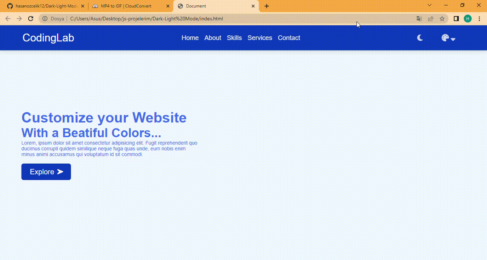

• A front-end was created using css and html software.
Later, 
by giving the icons a pop-up feature with javascript,
the colors of the buttons at the bottom were made to be the color of the general page when clicked

## Screen

